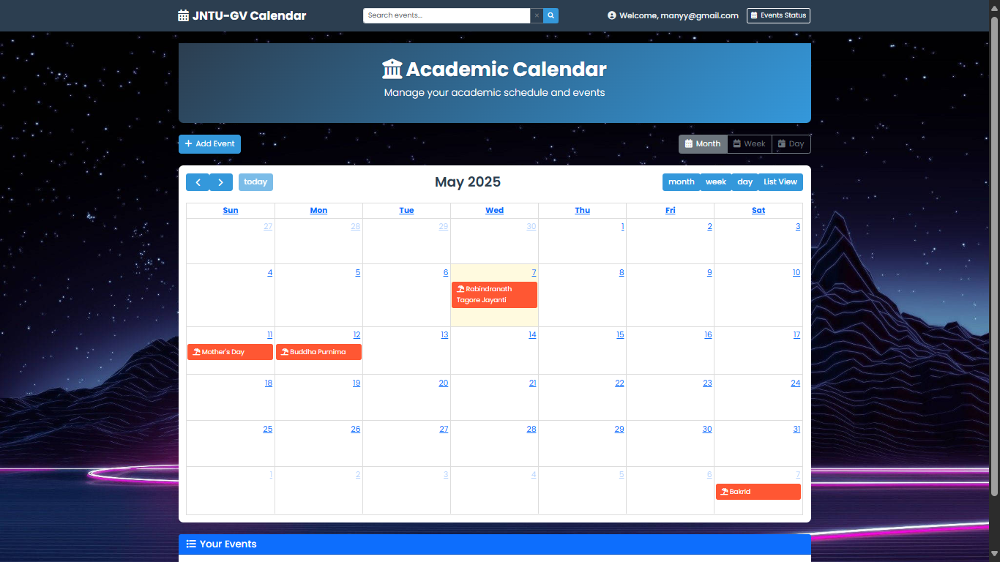

# UniversityCalendar
This project is a University Calendar Management System designed to efficiently handle academic events. It offers features such as adding, updating, and deleting events, ensuring administrators can manage important dates with ease. Additionally, the system includes an email notification feature, automatically informing students and faculty about upcoming events, schedule changes, or cancellations. With a user-friendly interface and seamless event tracking, the system enhances organization, reduces miscommunication, and keeps the academic community well-informed. Whether managing exams, holidays, or special lectures, this calendar system streamlines scheduling and improves accessibility for all users.

# LIVE PREVIEW

